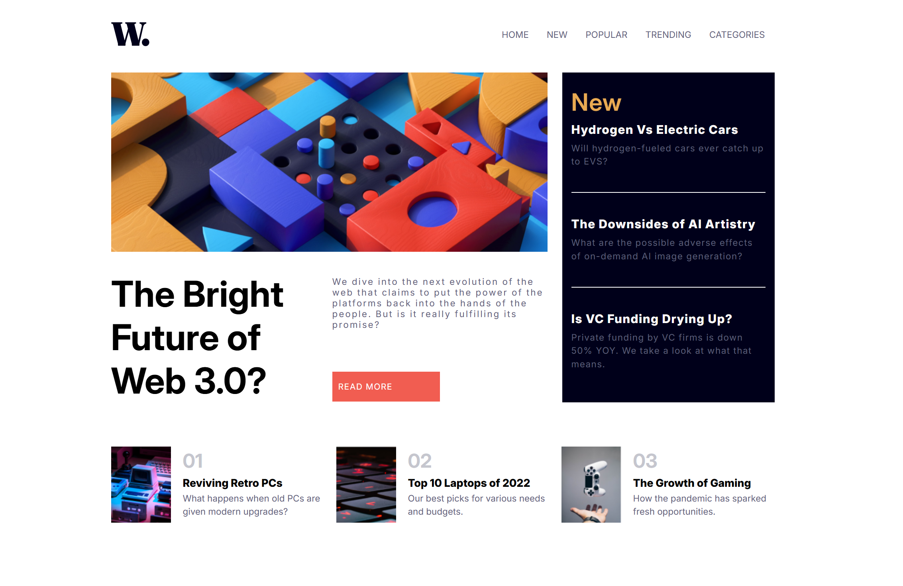

<h1 align="center"># 🌟 CSS Mastery Test Project 🌟

## 📸 Demo

<p align="center">
  
</p>


---


## 📖 Description
This project was created as a way to test our knowledge after learning CSS fundamentals.
It allowed us to practice and apply CSS concepts such as Flexbox, Grid, and responsive design.

---

## 🔧 Technologies Used
- **HTML5**: Structuring the webpage.
- **CSS3**: Styling and responsiveness.

---

## 🚀 Features
- ✅ Responsive design using CSS media queries.
- ✅ Flexbox and Grid for layout structure.
- ✅ Clean and organized CSS structure.

---

## 🛠 Installation & Usage
1. **Download or clone the repository**.
2. **Open `index.html` in your browser.**

---

## 📂 Project Structure
```
/project-folder
│── assets/       # Images and resources
│── index.html    # Main HTML file
│── style.css     # CSS stylesheet
│── README.md     # Project documentation
```

---

## 📌 Possible Improvements
- 🔄 Improve responsive behavior for different screen sizes.
- 🎨 Enhance styling for a more polished look.


---

## 👤 Author
- **Paule Jessica** - [GitHub](https://github.com/Nkapj)

---

<h1 align="center"> # 🌟 Projet de Test Maîtrise CSS 🌟


---


## 📖 Description
Ce projet a été réalisé comme un moyen de tester nos connaissances après avoir appris les bases du CSS.
Il nous a permis de pratiquer et d'appliquer des concepts CSS tels que Flexbox, Grid et le design responsive.

---

## 🔧 Technologies Utilisées
- **HTML5** : Structuration de la page web.
- **CSS3** : Mise en page et responsivité.

---

## 🚀 Fonctionnalités
- ✅ Conception responsive avec media queries CSS.
- ✅ Utilisation de Flexbox et Grid pour la mise en page.
- ✅ Structure CSS propre et organisée.

---

## 🛠 Installation & Utilisation
1. **Téléchargez ou clonez le dépôt**.
2. **Ouvrez `index.html` dans votre navigateur.**

---

## 📂 Structure du Projet
```
/dossier-projet
│── assets/       # Images et ressources
│── index.html    # Fichier principal HTML
│── style.css     # Feuille de style CSS
│── README.md     # Documentation du projet
```

---

## 📌 Améliorations Possibles
- 🔄 Améliorer le comportement responsive pour différentes tailles d'écran.
- 🎨 Améliorer le style pour un rendu plus soigné.

---

## 👤 Auteur
- **Paule Jessica** - [GitHub](https://github.com/Nkapj)
